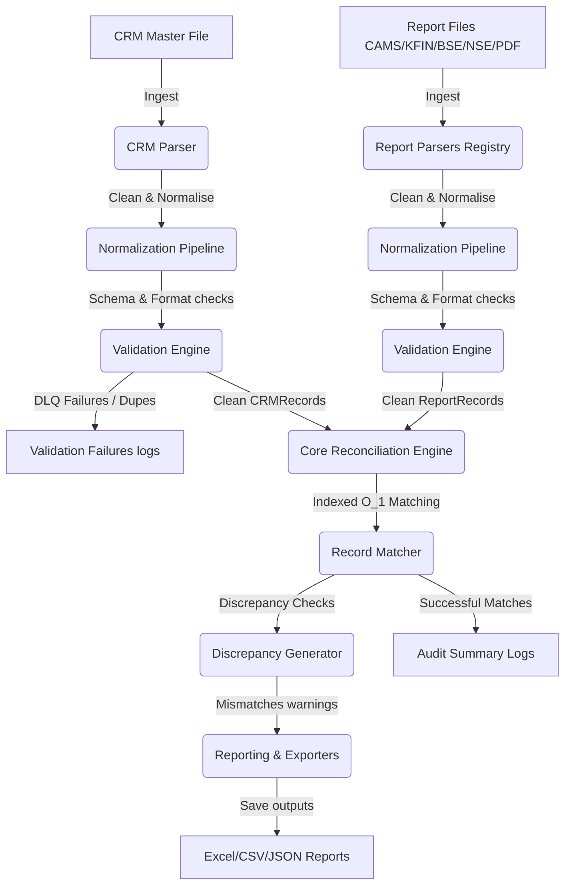

# Architecture Overview

The Mutual Fund Reconciliation Engine is constructed using a decoupled, modular pipeline to ensure performance scalability and strict auditable validation logs.

---

## E2E Ingestion & Matching Pipeline

---

## Pipeline Execution Lifecycle

1. **Ingestion Layer (`mfrecon.parsers`)**:
   * Uses Pydantic to structure records.
   * Auto-detects extensions (`.csv`, `.xlsx`, `.xls`, `.pdf`).
   * Decrypts password-protected PDF files using `pdfplumber` and isolates file failures dynamically.

2. **Normalization Layer (`mfrecon.normalizers`)**:
   * Standardizes fields: converts PAN to uppercase regex matches, strips whitespaces and formatting from emails and phone numbers, and maps date structures and decimal amounts.

3. **Validation Layer (`mfrecon.validators`)**:
   * Performs schema structure audits.
   * Separates exact and conflicting duplicate records into a distinct collection (DLQ), ensuring they do not pollute active reconciliation match logic.

4. **Reconciliation Layer (`mfrecon.engine`)**:
   * Performs indexed matching. Primary key (PAN) records undergo fast, hash-mapped O(1) alignment checks.
   * Optional name similarity fuzzy matching fallback checking is available.
   * Compiles natural-language explainability traces for discrepancies.

5. **Reporting Layer (`mfrecon.reporters`)**:
   * Writes multi-sheet styled Workbooks, streamed CSV tables, and structured JSON summaries.
