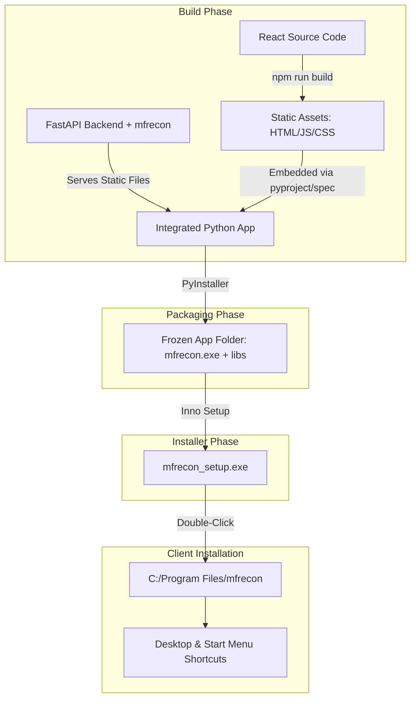

# Production Deployment Architecture: Installable Windows Application

This document outlines the architecture, build steps, and packaging pipeline to convert the existing React + FastAPI + `mfrecon` project into a single, double-clickable Windows installer (`mfrecon_setup.exe`).

---

## 1. Packaging Approach Comparison

Here is a comparative analysis of the three options for bundling our React + FastAPI stack:

| Criteria | 1. Electron Builder | 2. Tauri | 3. PyInstaller + Embedded Frontend (Recommended) |
| :--- | :--- | :--- | :--- |
| **Architecture** | Chromium Shell + Node runtime + Python Sidecar | OS Webview (WebView2) + Rust Shell + Python Sidecar | Python Backend serving built React files + `pywebview` / Browser |
| **Complexity** | **High**: Dual build pipelines (Node + Python), sidecar process lifecycle management, IPC bridge. | **High**: Requires Rust setup, cargo configurations, sidecar lifecycle code. | **Low**: Single Python build pipeline. React is pre-built to static HTML/JS and served by FastAPI. |
| **Bundle Size** | ~180MB - 250MB (includes Chromium + Node + Python runtime) | ~90MB - 120MB (includes Python runtime) | **~50MB - 80MB** (only Python runtime + assets) |
| **Resource Footprint** | High (separate Chromium rendering processes + Python process) | Medium (WebView2 + Python process) | **Low** (Single Python process running FastAPI + native webview shell) |
| **Process Management** | Prone to zombie Python processes if Electron crashes or is terminated abruptly. | Prone to zombie Python processes if Tauri is terminated abruptly. | **Extremely Safe**: FastAPI and GUI window run in the same process space; window closure terminates the python process. |

### Recommendation: PyInstaller + Embedded Frontend + pywebview (or default browser)
This is the **simplest, most lightweight, and most reliable** solution. It does not introduce Rust or Node.js runtime layers. Instead, we compile the React frontend to a static `dist/` directory, configure FastAPI to serve these static files, and use PyInstaller to freeze Python, FastAPI, dependencies, and frontend assets into a single executable. We then use **Inno Setup** to compile that folder into `mfrecon_setup.exe`.

---

## 2. Packaging Architecture



---

## 3. Integrated App Launcher (`gui_launcher.py`)

A unified launcher script is created in the project root. This script handles starting the FastAPI server in a background thread and launching a borderless native Windows webview window pointing to the local port:

```python
# gui_launcher.py
import os
import sys
import time
import threading
import multiprocessing
import uvicorn
import webview

def start_backend():
    # Retrieve system ports or default to 8000
    port = int(os.environ.get("MFRECON_PORT", 8000))
    # Import FastAPI app inside the function to defer imports until process is frozen
    from backend.main import app
    uvicorn.run(app, host="127.0.0.1", port=port, log_level="warning")

def get_asset_path():
    """Get absolute path to resource, works for dev and for PyInstaller."""
    if hasattr(sys, '_MEIPASS'):
        return sys._MEIPASS
    return os.path.dirname(os.path.abspath(__file__))

if __name__ == '__main__':
    # Required for PyInstaller frozen executables using multiprocessing (e.g. rapidfuzz/pandas)
    multiprocessing.freeze_support()
    
    # Configure custom port to avoid conflicts
    port = 24128
    os.environ["MFRECON_PORT"] = str(port)
    os.environ["MFRECON_ASSET_DIR"] = os.path.join(get_asset_path(), "dist")

    # Start FastAPI backend in a daemon thread
    backend_thread = threading.Thread(target=start_backend, daemon=True)
    backend_thread.start()

    # Give uvicorn a brief moment to bind to the local port
    time.sleep(1.2)

    # Launch Native WebView Window pointing to the local FastAPI server
    webview.create_window(
        title="Goyama Financial Reconciliation System",
        url=f"http://127.0.0.1:{port}/",
        width=1366,
        height=850,
        resizable=True,
        min_size=(1024, 768)
    )
    # This starts the GUI window loop; when closed, python exits and uvicorn thread terminates
    webview.start()
```

---

## 4. Serving the Frontend from FastAPI

Modify [backend/main.py](file:///d:/pythonengine/pythonenginecrm/mfrecon-ui/backend/main.py) to host the static React bundle.

```python
import os
from fastapi.staticfiles import StaticFiles
from fastapi.responses import FileResponse

# ... Register routers ...

# Mount static files folder if it exists (for production build)
asset_dir = os.environ.get("MFRECON_ASSET_DIR")
if asset_dir and os.path.exists(asset_dir):
    # Serve css/js/icons
    assets_path = os.path.join(asset_dir, "assets")
    if os.path.exists(assets_path):
        app.mount("/assets", StaticFiles(directory=assets_path), name="assets")
        
    # Serve index.html for all other frontend pages (React client routing support)
    @app.get("/{fallback_path:path}")
    async def serve_frontend(fallback_path: str):
        index_html = os.path.join(asset_dir, "index.html")
        return FileResponse(index_html)
```

---

## 5. Build Process Script (`build.bat`)

Here is the automated batch build script (`build.bat`) to be run on the developer's computer. It performs all operations automatically:

```batch
@echo off
echo ==============================================
echo Building mfrecon Release Package for Windows
echo ==============================================

:: 1. Build React Frontend
echo [1/4] Building React Frontend static assets...
cd mfrecon-ui\frontend
call npm run build
if %errorlevel% neq 0 (
    echo React build failed!
    exit /b %errorlevel%
)
cd ..\..

:: 2. Copy Frontend dist to root for PyInstaller bundle
echo [2/4] Staging built static assets...
xcopy /E /I /Y mfrecon-ui\frontend\dist dist

:: 3. Freeze App with PyInstaller
echo [3/4] Packaging backend and frontend via PyInstaller...
call venv\Scripts\activate
pip install pywebview pyinstaller
pyinstaller --name="mfrecon" ^
            --noconfirm ^
            --windowed ^
            --add-data "dist;dist" ^
            --add-data "mfrecon;mfrecon" ^
            --add-data "recon_config.yaml;." ^
            --icon="mfrecon-ui\frontend\public\vite.svg" ^
            gui_launcher.py

if %errorlevel% neq 0 (
    echo PyInstaller packaging failed!
    exit /b %errorlevel%
)

:: 4. Build Installer
echo [4/4] Creating double-click setup installer...
"C:\Program Files (x86)\Inno Setup 6\ISCC.exe" installer.iss
if %errorlevel% neq 0 (
    echo Inno Setup compilation failed! Make sure Inno Setup is installed.
    exit /b %errorlevel%
)

echo ==============================================
echo Build Successful! Installer created at:
echo dist\mfrecon_setup.exe
echo ==============================================
```

---

## 6. Installer Configuration (`installer.iss`)

We use **Inno Setup** (free, industry-standard Windows installer creator) to produce the standalone executable. The setup configuration `installer.iss` specifies the shortcuts, desktop icons, and files:

```ini
; installer.iss
[Setup]
AppName=Goyama Financial Reconciliation
AppVersion=2.0.0
DefaultDirName={autopf}\GoyamaRecon
DefaultGroupName=GoyamaRecon
UninstallDisplayIcon={app}\mfrecon.exe
Compression=lzma2
SolidCompression=yes
OutputDir=dist
OutputBaseFilename=mfrecon_setup
SetupIconFile=mfrecon-ui\frontend\public\favicon.ico
ArchitecturesAllowed=x64
ArchitecturesInstallIn64BitMode=x64

[Files]
Source: "dist\mfrecon\*"; DestDir: "{app}"; Flags: recursesubdirs createallsubdirs

[Icons]
Name: "{group}\Goyama Reconciliation"; Filename: "{app}\mfrecon.exe"
Name: "{autodesktop}\Goyama Reconciliation"; Filename: "{app}\mfrecon.exe"; IconFilename: "{app}\favicon.ico"

[Run]
Filename: "{app}\mfrecon.exe"; Description: "Launch Goyama Reconciliation"; Flags: postinstall nowait
```

---

## 7. Folder Structure for Production Build

When PyInstaller freezes the app, the output folder `dist/mfrecon` will contain:

```text
dist/mfrecon/
├── mfrecon.exe             # The frozen launcher executable
├── recon_config.yaml       # Embedded configuration rules
├── dist/                   # Embedded static React frontend
│   ├── index.html          # Main HTML page
│   └── assets/             # Bundled JS, CSS, fonts, and images
├── mfrecon/                # Embedded reconciliation engine modules
├── _internal/              # Python DLLs, C-extensions, and package dependencies (pandas, openpyxl, etc.)
└── ...
```

This folder is compiled by Inno Setup into a single file: **`mfrecon_setup.exe`** (~45MB to 60MB).

---

## 8. Distribution Strategy

1. **Host `mfrecon_setup.exe`**: Upload the compiled setup file to a secure cloud bucket (e.g., AWS S3, Google Cloud Storage, or Azure Blob) or shared corporate drive.
2. **Download link**: Email the download link directly to clients.
3. **Run**:
   - Client downloads `mfrecon_setup.exe`.
   - Client double-clicks `mfrecon_setup.exe`.
   - Setup installs the app to `C:\Program Files\GoyamaRecon`.
   - Setup adds a shortcut to the client's Desktop and Start Menu.
   - Client launches the app. The FastAPI server fires up instantly, and a native desktop window loads the interface automatically.
   - When finished, the client closes the window, and all backend components shut down gracefully.
