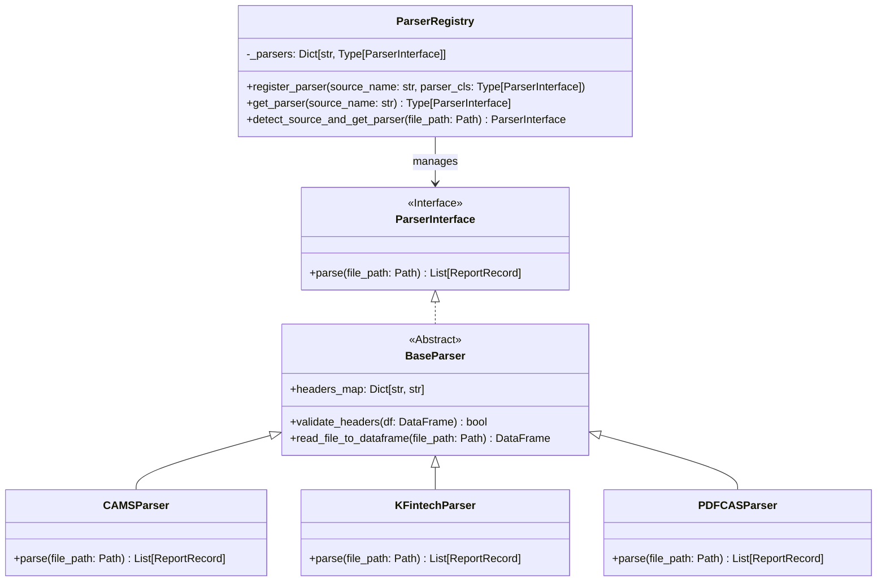

# Mutual Fund Reconciliation Engine
## Production-Grade Architecture & Implementation Blueprint (v2.1)

This document provides the finalized production-grade architecture design and build roadmap for the **Mutual Fund Reconciliation Engine**, custom-engineered for **Goyama Financial Services**. It establishes a standalone, deterministic, and auditable Python library for comparing client CRM master datasets against multiple external transaction and holding reports.

---

## 1. Matching Strategy (Risk-Managed Framework)

In financial reconciliation, matching errors have severe compliance and fiduciary risks. A false positive match (incorrectly linking different client records) can lead to data leaks and inaccurate customer statements, while a false negative (missing a match) results in operational backlogs.

### Risks of Fuzzy Matching
* **Fuzzy Matching Default Policy**: **Disabled by default.** 
* **False Positive Hazard**: Names like `"Ramesh Kumar Sharma"` and `"Ramesh Sharma"` could represent father/son, relatives, or completely unrelated individuals. Auto-reconciling these records on fuzzy name similarity alone can corrupt holding calculations.
* **Fuzzy Matching Rules**:
  * **Option-based Enablement**: Fuzzy matching must be explicitly enabled in configuration and can be enabled/disabled *per report source*.
  * **Secondary Verification Requirements**: A fuzzy name match is only eligible for reconciliation if it is supported by a **100% exact match of a secondary key** (e.g., Normalized Mobile Number or Normalized Email Address).
  * **Human-in-the-Loop Flagging**: Any record reconciled via fuzzy matching must have its discrepancy rating flagged as `FUZZY_MATCH_WARNING`, requiring explicit agent sign-off in the CRM.

### Production-Grade Matching Pipeline
```
               [ Input Record from Report ]
                           │
             Attempt Primary Match: Exact PAN
                           │
             ┌─────────────┴─────────────┐
             ▼                           ▼
       [PAN Matched?]             [PAN Mismatch / Missing?]
        /         \                      │
      YES          NO                    ▼
      /              \          Fuzzy Match Enabled?
     /                \          (Config check per source)
    ▼                  ▼                 /           \
Exact Match     Unreconciled            YES           NO
Reconciliation  (Proceed to Fuzzy)      /               \
                                       ▼                 ▼
                          Calculate Name Similarity    Report Record
                          (RapidFuzz Threshold >= 90%)   Unmatched
                                       │              (MISSING)
                                 [Above Threshold?]
                                   /          \
                                 YES           NO
                                 /               \
                                ▼                 ▼
                      Verify Contact (Mobile/Email) Unmatched
                                │                 (MISSING)
                          [Contact Matched?]
                            /          \
                          YES           NO
                          /               \
                         ▼                 ▼
                 Reconcile (Fuzzy Flag)  Unmatched
```

---

## 2. Parser Architecture & Plugin System

To prevent codebase bloat when new broker or distributor report formats are introduced, the engine decouples the file parsing mechanics from the core matching logic using a **Registry-based Plugin Architecture**.



### Dynamic Extensibility via Registry
* **Independent Parsers**: Every source (CAMS, KFintech, BSE, NSE, PDF CAS, CRM) has its own dedicated parser class derived from `BaseParser`.
* **Zero Core Modifications**: Adding a new report type (e.g., "Groww Excel Report") only requires writing a new class implementing `ParserInterface` and registering it with `ParserRegistry.register_parser("GROWW", GrowwParser)`.
* **Auto-Detection**: The registry checks file extensions, header columns, and internal metadata signatures of incoming files to dynamically match and instantiate the correct parser.

---

## 3. Configuration System (YAML Design)

The engine separates environment settings from business logic using a hierarchical configuration layout. Below is the structure for the `recon_config.yaml` file:

```yaml
# Mutual Fund Reconciliation Engine Configurations
engine:
  run_mode: "STRICT" # STRICT (Raise exceptions on file error) or TOLERANT (Skip invalid rows)
  amount_epsilon: 0.01 # Float tolerance for holding balances (INR)
  date_days_tolerance: 3 # Maximum allowed transaction date offset for match matching

matching:
  primary_key: "pan"
  enable_fuzzy_matching: false # Disabled by default
  fuzzy_threshold: 0.92 # Minimum Levenshtein score (0.00 - 1.00)
  fuzzy_secondary_keys:
    - "mobile"
    - "email"
  source_overrides:
    CAMS:
      enable_fuzzy_matching: true
      fuzzy_threshold: 0.90
    KFINTECH:
      enable_fuzzy_matching: false

validation:
  require_pan: true
  validate_kyc_status: true
  validate_fatca_status: true
  allowed_kyc_statuses: ["VERIFIED", "EXEMPT"]
  allowed_fatca_statuses: ["COMPLIANT"]

reporting:
  default_output_formats: ["excel", "csv", "json"]
  redact_sensitive_fields: true # Mask parts of PAN, Email, and Phone in exports
  severity_mappings:
    MISSING_IN_CRM: "CRITICAL"
    MISSING_IN_REPORT: "HIGH"
    AMOUNT_MISMATCH: "CRITICAL"
    NAME_MISMATCH: "HIGH"
    MOBILE_MISMATCH: "MEDIUM"
    EMAIL_MISMATCH: "MEDIUM"
    KYC_MISMATCH: "MEDIUM"
    FATCA_MISMATCH: "HIGH"
    DATE_MISMATCH: "LOW"
```

---

## 4. Source-Specific Reconciliation Rules Framework

To reduce false mismatches and avoid generating errors for fields not supplied by a particular source (e.g., generating `EMAIL_MISMATCH` when a CAS PDF contains no email data), the engine introduces **Source Profiles**.

### 4.1 Source Profiles Specification
Each data source is defined by a profile outlining what data it supports, what is mandatory, what is compared, and what validates on ingestion:

| Source | Available Fields | Required Fields | Comparable Fields | Supported Validations |
| :--- | :--- | :--- | :--- | :--- |
| **CRM** | `pan`, `name`, `mobile`, `email`, `kyc`, `fatca`, `status`, `amount` | `pan`, `name` | *(Master)* | `pan_format`, `mobile_format`, `email_format` |
| **CAMS** | `pan`, `name`, `mobile`, `email`, `kyc`, `fatca`, `status`, `amount` | `pan`, `name` | `pan`, `name`, `mobile`, `email`, `kyc`, `fatca`, `status`, `amount` | `pan_format`, `mobile_format`, `email_format` |
| **KFINTECH**| `pan`, `name`, `mobile`, `status`, `amount` | `pan`, `name` | `pan`, `name`, `mobile`, `status`, `amount` | `pan_format`, `mobile_format` |
| **PDF_CAS** | `pan`, `name`, `mobile` (sometimes), `amount` | `pan`, `name` | `pan`, `name`, `mobile`, `amount` | `pan_format`, `mobile_format` |
| **BSE** | `pan`, `name`, `email`, `amount` | `pan`, `name` | `pan`, `name`, `email`, `amount` | `pan_format`, `email_format` |
| **NSE** | `pan`, `name`, `mobile`, `email`, `amount` | `pan`, `name` | `pan`, `name`, `mobile`, `email`, `amount` | `pan_format`, `mobile_format`, `email_format` |

### 4.2 Configuration Extension
The `recon_config.yaml` file is extended under a `sources` section to manage these rules dynamically:

```yaml
sources:
  CAMS:
    available_fields: ["pan", "investor_name", "mobile", "email", "kyc_status", "fatca_status", "investor_status", "total_amount"]
    required_fields: ["pan", "investor_name"]
    compare: ["pan", "investor_name", "mobile", "email", "kyc_status", "fatca_status", "investor_status", "total_amount"]
    validations: ["pan_format", "mobile_format", "email_format"]

  KFINTECH:
    available_fields: ["pan", "investor_name", "mobile", "investor_status", "total_amount"]
    required_fields: ["pan", "investor_name"]
    compare: ["pan", "investor_name", "mobile", "investor_status", "total_amount"]
    validations: ["pan_format", "mobile_format"]

  PDF_CAS:
    available_fields: ["pan", "investor_name", "mobile", "total_amount"]
    required_fields: ["pan", "investor_name"]
    compare: ["pan", "investor_name", "mobile", "total_amount"]
    validations: ["pan_format", "mobile_format"]

  BSE:
    available_fields: ["pan", "investor_name", "email", "total_amount"]
    required_fields: ["pan", "investor_name"]
    compare: ["pan", "investor_name", "email", "total_amount"]
    validations: ["pan_format", "email_format"]

  NSE:
    available_fields: ["pan", "investor_name", "mobile", "email", "total_amount"]
    required_fields: ["pan", "investor_name"]
    compare: ["pan", "investor_name", "mobile", "email", "total_amount"]
    validations: ["pan_format", "mobile_format", "email_format"]
```

### 4.3 Dynamic Reconciliation Execution Flow
When the reconciler evaluates a pair of records (CRM record vs Report record), it retrieves the report's source profile:
1. It loops through fields of the CRM record.
2. For each field, it checks: **Is this field listed in the Report source's `compare` configuration?**
3. If **YES**: Perform comparison (e.g., compare `email`).
4. If **NO**: Bypasses comparison for this field, suppresses discrepancies like `EMAIL_MISMATCH` or `FATCA_MISMATCH`, and appends an entry to the skipped comparisons list in the audit trace metadata.

---

## 5. Auditability & Explainable Reconciliation

For enterprise audit compliance, the library generates **explainable discrepancies**. When a discrepancy is detected, the engine appends an execution log trace directly to the discrepancy record, describing the decision path.

### Detailed Domain Model with Audit Trace

```python
from pydantic import BaseModel, Field
from typing import Dict, List, Optional

class AuditTrace(BaseModel):
    matching_route: str = Field(..., description="E.g., EXACT_PAN, FUZZY_NAME_AND_MOBILE, UNMATCHED")
    match_confidence: float = Field(1.0, description="Match confidence score (0.0 to 1.0)")
    evaluation_timestamp: str
    reconciler_version: str
    rule_evaluated: str = Field(..., description="Configuration rule matching applied")
    skipped_comparisons: List[str] = Field(default_factory=list, description="Fields skipped during comparison due to source profile omissions")

class Discrepancy(BaseModel):
    discrepancy_type: str
    pan: str
    field_name: Optional[str] = None
    crm_value: Optional[str] = None
    report_value: Optional[str] = None
    severity: str
    explanation: str = Field(..., description="Plain English description of why the mismatch occurred")
    source_info: Dict[str, str] = Field(..., description="File metadata including row number, sheet name, and file hash")
    audit_trace: AuditTrace
```

### Explainability Log Traces for Bypassed Fields
To ensure full audit traceability, skipped fields are logged dynamically.
* **Discrepancy Skip Reason Example**: If the reconciler compares a `PDF_CAS` record, it skips checking `email` and logs in the run details:
  > `"EMAIL_MISMATCH check skipped because source PDF_CAS does not provide email data."`
  > `"FATCA_MISMATCH check skipped because source PDF_CAS does not provide FATCA data."`
* **Pydantic Capture**: The skipped checks are stored inside `audit_trace.skipped_comparisons` (e.g., `["email", "fatca_status", "kyc_status"]`) so the CRM can easily render to users exactly why certain mismatches were omitted.

---

## 6. Accuracy & Normalization Specifications

To prevent false mismatches caused by inconsistent data entries across platforms, strict normalization pipelines are applied before validation and reconciliation.

```
       [Raw Input String]
               │
      PAN Normalization ───► Strip spaces/hyphens ───► Capitalize ───► Validate Checksum
               │
     Name Normalization ───► Strip Salutations ───► Remove Joint Suffixes ───► Whitespace Collapse
               │
    Mobile Normalization ───► Keep digits only ───► Strip prefix (0, +91) ───► Verify 10-digits
               │
     Email Normalization ───► Trim ───► Lowercase ───► Validate Regex
               │
      Date Normalization ───► Match multi-formats ───► Coerce to YYYY-MM-DD
```

### Normalization Details
1. **PAN Standardizer**:
   * Action: Strip spaces, hyphens, and slashes. Cast to uppercase.
   * Regex Verification: `^[A-Z]{5}[0-9]{4}[A-Z]{1}$`
2. **Name Standardizer**:
   * Action: Remove common titles (`Mr`, `Mrs`, `Ms`, `Dr`, `Late`, `M/S`, `HUF`).
   * Suffix handling: Strip joint holder expressions like `/ Joint`, `/ Jt`, `JOINT HOLDER`.
   * Whitespace: Replace double/triple spaces with single spaces. Trim ends.
3. **Mobile Standardizer**:
   * Action: Remove non-digits. If length is $> 10$ and starts with `91` or `0`, strip the prefix.
   * Verification: Reject mobile values that are not exactly 10 digits or contain repeating sequences (e.g. `0000000000`).
4. **Email Standardizer**:
   * Action: Trim space, convert to lowercase.
   * Format check: Must conform to standard RFC 5322 structure.
5. **Date Standardizer**:
   * Action: Attempt parsing across multiple formats (`%Y-%m-%d`, `%d-%m-%Y`, `%d-%b-%Y`, `%d/%m/%Y`).
   * Excel specific: Detect and parse Excel serial dates (e.g., `45000` integers) to prevent parsing errors.
6. **Duplicate Record Detection**:
   * Group inputs by `Normalized PAN` + `Folio Number`. If duplicates are detected, identify if they are transaction records (which should match exactly on transaction IDs/dates) or holding balances (which are aggregated). Flag duplicate errors if the file contains redundant conflicting entries.

---

## 7. Enterprise Readiness

### Structured Logging & Monitoring
* **Log Rotation & Levels**: Logs are separated into `recon_audit.log` (structured business auditing) and `recon_debug.log` (detailed trace for debugging).
* **Environment Logging**: Automatically records machine CPU utilization, Python memory consumption, and execution durations for profiling.

### Fail-Safe Error Isolation (Dead Letter Queue Pattern)
If a row fails parsing or schema validation, the engine captures the row, writes it to a **Dead Letter Queue (DLQ)** file (e.g., `failed_records_[run_id].json`), and continues execution. This prevents a single corrupt row from failing an entire batch run.

```python
# Isolated Row Try-Except Block
try:
    normalized_row = Normalizer.run(raw_row)
    validated_row = Validator.run(normalized_row)
    clean_list.append(validated_row)
except ValidationError as e:
    dlq_logger.log_failed_row(raw_row, reason=str(e))
    metadata.validation_failures_count += 1
```

### Package Distribution
* Distributed as a packaged **Python Wheel (`.whl`)** with strictly pinned dependencies (`pandas==2.2.2`, `rapidfuzz==3.9.3`, `pydantic==2.7.4`, `openpyxl==3.1.5`).
* Installs cleanly in any client-side virtual environment with zero external database dependencies.

---

## 8. Build Roadmap & Source-Specific Impacts

```
Phase 1: Core Models ──► Phase 2: CRM Parser ──► Phase 3: Report Parsers
                                                         │
Phase 6: Reconciler  ◄── Phase 5: Validator   ◄── Phase 4: Normalizer
      │
Phase 7: Reporting   ──► Phase 8: Audit & DLQ
```

### Phase 1: Core Models & Schema Definitions
* **Goal**: Establish core type structures, schemas, and configurations.
* **Deliverables**: Pydantic models for inputs, outputs, config parser, and base exceptions.
* **Roadmap Impact (v2.1)**: Define `SourceProfile` configuration schema. Update `AuditTrace` schema to store `skipped_comparisons`.
* **Dependencies**: None.
* **Risks**: Schema changes later in development. *Mitigation*: Validate structure against mock configs.
* **Test Strategy**: Unit test configuration loader parsing of Source Profiles.

### Phase 2: CRM Parser Implementation
* **Goal**: Parse Excel/CSV CRM master files into the internal CRM data structure.
* **Deliverables**: CRM parser implementation class, header mapper.
* **Dependencies**: Phase 1.
* **Risks**: Malformed Excel sheets. *Mitigation*: Implement strict header checks.
* **Test Strategy**: Parameterized tests verifying parser validation boundaries.

### Phase 3: Report Parsers & Plugin Registry
* **Goal**: Parse external report formats (CAMS, KFintech, BSE, NSE, PDF CAS) dynamically.
* **Deliverables**: Registry manager, individual parser subclasses, pdfplumber engine integration.
* **Dependencies**: Phase 2.
* **Risks**: PDF layout updates from AMCs. *Mitigation*: Dynamic cell bounding coordinates.
* **Test Strategy**: Unit tests of parsers returning partial data schemas mapped to their sources.

### Phase 4: Normalization Layer
* **Goal**: Implement sanitization routines for Names, PANs, Mobiles, and Dates.
* **Deliverables**: Normalization module functions, standard enums mapping.
* **Dependencies**: Phase 3.
* **Risks**: Over-normalization leading to match loss. *Mitigation*: Hold raw values inside source_info for transparency.
* **Test Strategy**: Check conversions of formatting variations.

### Phase 5: Validation Engine
* **Goal**: Identify duplicates, missing mandatory values, and syntax errors.
* **Deliverables**: Validator class, list rules executor.
* **Roadmap Impact (v2.1)**: Validate that fields in the parsed report match the `available_fields` of the source profile, and only run validations configured in the profile's `validations` list.
* **Dependencies**: Phase 4.
* **Risks**: Schema deviations. *Mitigation*: Strict source profile check limits.
* **Test Strategy**: Validate error-isolation and dead letter logging boundaries.

### Phase 6: Reconciliation Engine
* **Goal**: Perform exact and secondary matching; generate discrepancy matrix.
* **Deliverables**: Matcher, Reconciler core, fuzzy calculator.
* **Roadmap Impact (v2.1)**: Modify reconciler main comparison loops to dynamically check if the field is present in the source profile's `compare` list. If absent, skip comparison and register to `skipped_comparisons` trace array.
* **Dependencies**: Phase 5.
* **Risks**: Performance drop. *Mitigation*: Fast index lookup of comparables.
* **Test Strategy**: Integration tests evaluating PDF_CAS records and verifying that `EMAIL_MISMATCH` is never triggered and that skipped details appear in output JSON logs.

### Phase 7: Excel/CSV/JSON Reporting
* **Goal**: Export reconciliation outputs in structured, user-friendly formats.
* **Deliverables**: ExcelReporter, CSVReporter, JSONReporter.
* **Dependencies**: Phase 6.
* **Risks**: File lockouts during write operations. *Mitigation*: Unique Run UUID naming.
* **Test Strategy**: Verify correct columns are generated for each output report format.

### Phase 8: Audit, Logs & Dead Letter Queue (DLQ)
* **Goal**: Establish processing trace logs, checksum validations, and isolated error capture files.
* **Deliverables**: File hash calculator, JSONL logger, DLQ processor.
* **Roadmap Impact (v2.1)**: Formatter outputs explainability log traces detailing exactly which fields were omitted based on report source type.
* **Dependencies**: Phase 7.
* **Risks**: High file storage footprint. *Mitigation*: Implement automatic log pruning configurations.
* **Test Strategy**: Confirm that audit traces accurately log comparison skips.
